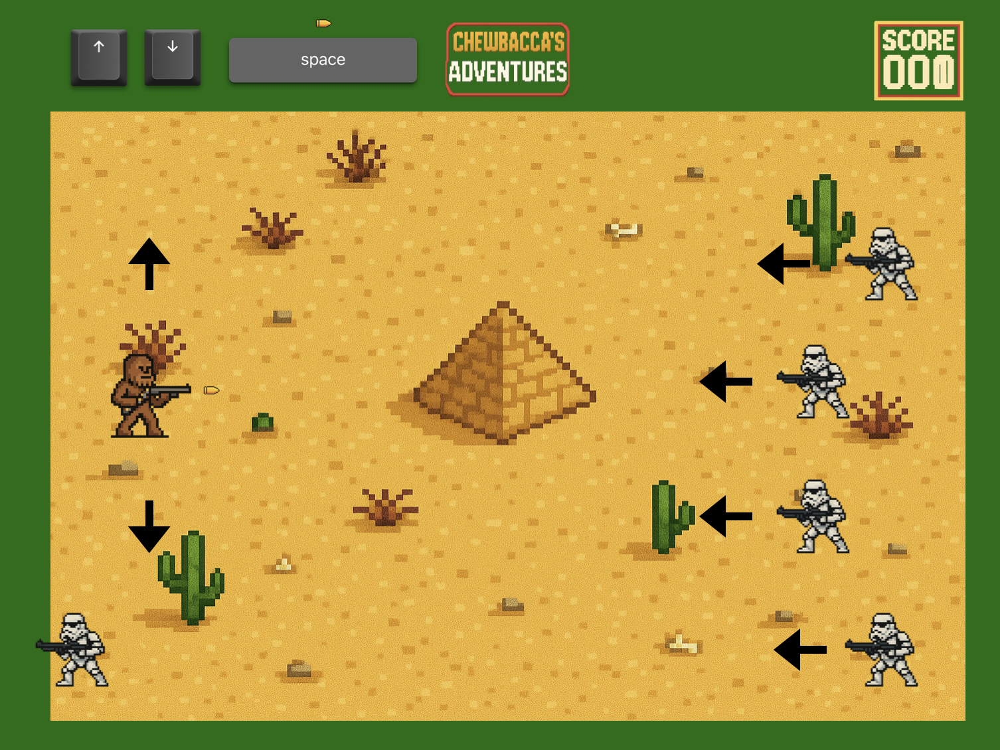

### Data
- Project title: Chewbacca's Adventure
- Author: Nestor Hilchenbach
- Course: Tech Basics // 2nd Semester
- Date: 15.09.2025

## Summary

"Chewbacca's Adventure" is a retro-style arcade shooter made in Python with Pygame. You control Chewbacca, who is the last line of defense against oncoming stormtroopers. 

It was created as a University project to learn python in practice by creating this small, but functional game. 

### First Idea / Inspiraion
The very first idea to do an arcade style shooter came, when we were doing our research assignment and I came across this git (https://github.com/attreyabhatt/Space-Invaders-Pygame/blob/master/main.py). 

Similarly a field trip a couple weeks before to the "Computer Museum Oldenburg" and the display of olf arcade games inspired me. 

The first sketch I than made already looked fairly similar to the final product as I was very happy with the illustrations. 

### Development process

I first started off by designing the screen and implementing the background. I was able to reuse a lot here from an old Animation assignment we did in class. 

The next step was creating the classes needed. I struggled a little bit to animate Chewbacca as I had my struggles with continuous movement at first.

The next stop was probably the one I struggled with the most. After I was able to spawn the Troopers continuously, I was trying to integrate a collision detection system and kept crushing the game, whenever the bullets past the stormtrooper. Luckily I found a nice video, which simplified the function and made it work. 

After that the main focus was on making it feel more like a complete game. So I installed a score, as well as a starting and a "Game Over-Screen". This is made it feel more complete immediately. 

Lastly I tried to incorporate a continously improving difficulty, by adjusting the Troopers speed based on the score. This worked out well and was simply incorporated. 

### Future improvements

There are still a couple things I'm not that happy about and I would have liked to improve If i had more time or ability (or both). 

- Sounds and background music
- different types of enemies (shooting back at you)
- different types of weapons
- a more interesting way of increasing difficulty (manipulating spawn rates.)
- many more..

### Material used 

- Collision detection: https://www.youtube.com/watch?v=OGrpWRHb6Nw&t=426s
- Positioning on screen: https://www.pygame.org/docs/ref/rect.html
- Fonts: https://www.pygame.org/docs/ref/font.html
- Media creation: https://chatgpt.com Image creator